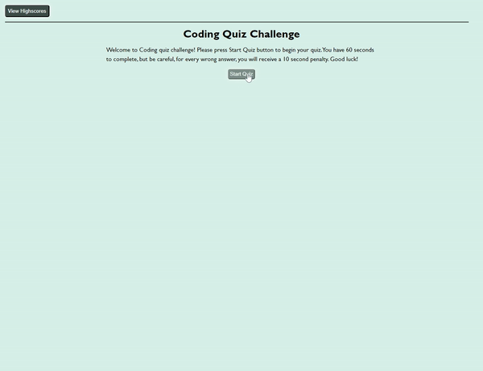

# Code Quiz

## Description

The goal of this project was to build a timed coding quiz with multiple-choice questions on JavaScript fundamentals. This web application runs in the browser and features dynamically updated HTML and CSS powered by JavaScript code.

- When user navigates to the webpage, they are presented with a Welcome screen. 
- When they press "Start Quiz" button, timer starts at the upper right corner and first question shows on the screen. 
- When user clicks on the answer they think is correct, application informs user if it's Correct or Wrong.
- If wrong answer is selected, 10 seconds get deducted from the timer before next question would show.
- If correct answer is selected, next question shows without any changes to the timer. 
- Once all questions are answered or if user runs out of time, new screen with results shows up. 
- User able to enter their initials and save their score. 
- They have option to try again by pressing button "Try Again".
- At any point user can view highscores currently stored and clear all results. 
- Highscores are sorted from highest to lowest and only top 10 results are displayed. 

## Usage

Web application is located at: 

To start quiz, user needs to click "Start Quiz" button. User can click "View Highscores" button at any time to view highscores. 

Quick tour of the web application usage shown below: 

## Credits

Questions for the quiz are taken from https://www.w3schools.com/

## License

Please refer to the LICENSE in the repo.